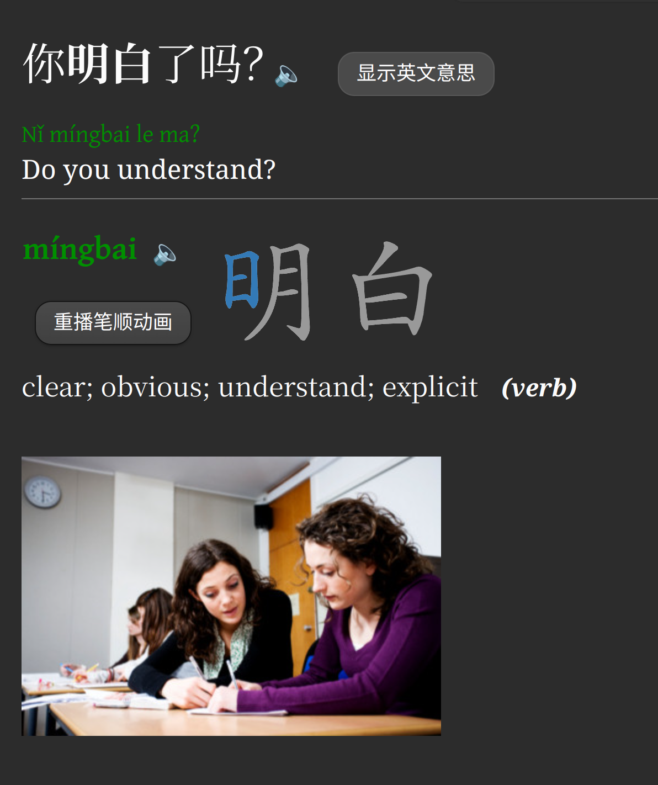
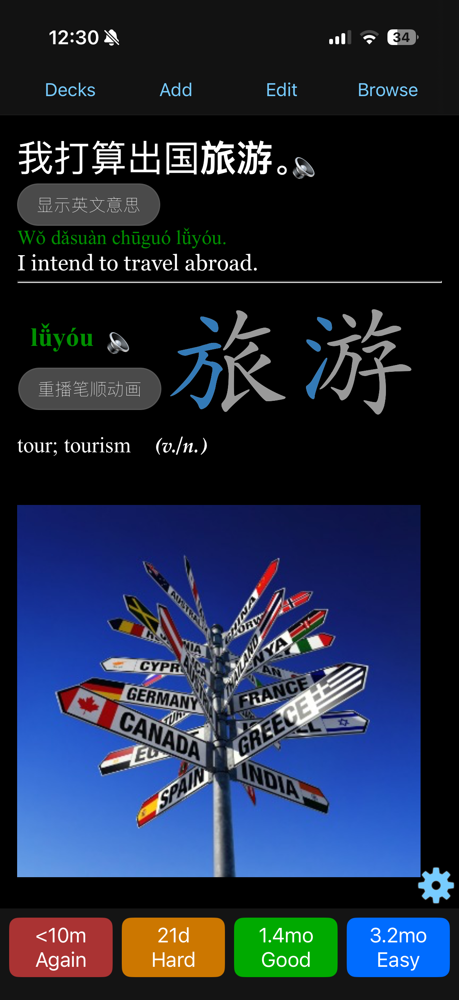
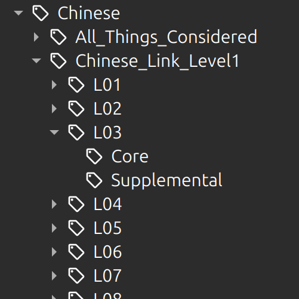

# ChineseDeck

A media-rich Anki deck for learning Chinese vocabulary.
---

Download the deck <a href="https://drive.google.com/file/d/1Q2FrH8AYSKO1-I5Xh8TcKraBLUU7z6VL/view?usp=sharing"> here </a> 
Get Anki  <a href="https://apps.ankiweb.net">here</a>

## Features

- Pinyin
- Audio
- Example sentences
- Images
- Stroke order animations
- 5,716 of the most common Chinese words and patterns

---

## Screenshots

<table align="center" style="border-collapse: separate; border-spacing: 24px 28px; margin: 0 auto;">
  <tr>
    <td align="center" valign="middle" style="width: 340px; padding: 0;">
      
      
<strong>Card front</strong>

    </td>
    <td align="center" valign="middle" style="width: 340px; padding: 0;">
      
      
<strong>Card back</strong>

    </td>
  </tr>
  <tr>
    <td align="center" valign="middle" style="width: 340px; padding: 0;">
      
      
<strong>Flashcards on Anki Mobile (iPhone) </strong>

    </td>
    <td align="center" valign="middle" style="width: 340px; padding: 0;">
      
      
<strong>Some of the the built-in tags</strong>

    </td>
  </tr>
</table>

---

## Info

The cards are tagged for organization. Categories include HSK 1 - HSK 6, as well as the core & supplemental vocabulary lists from <i> Chinese Link: Level 1</i>, <i>Chinese Link: Level 2</i>, and <i>All Things Considered.</i>

All of the media is included in the deck, so there's no need for any plugins.

I recommend starting with all cards suspended and then gradually unsuspending them as you go.
I hope you find it useful! 

---

## Video Demo

  

Click to watch on YouTube. 
